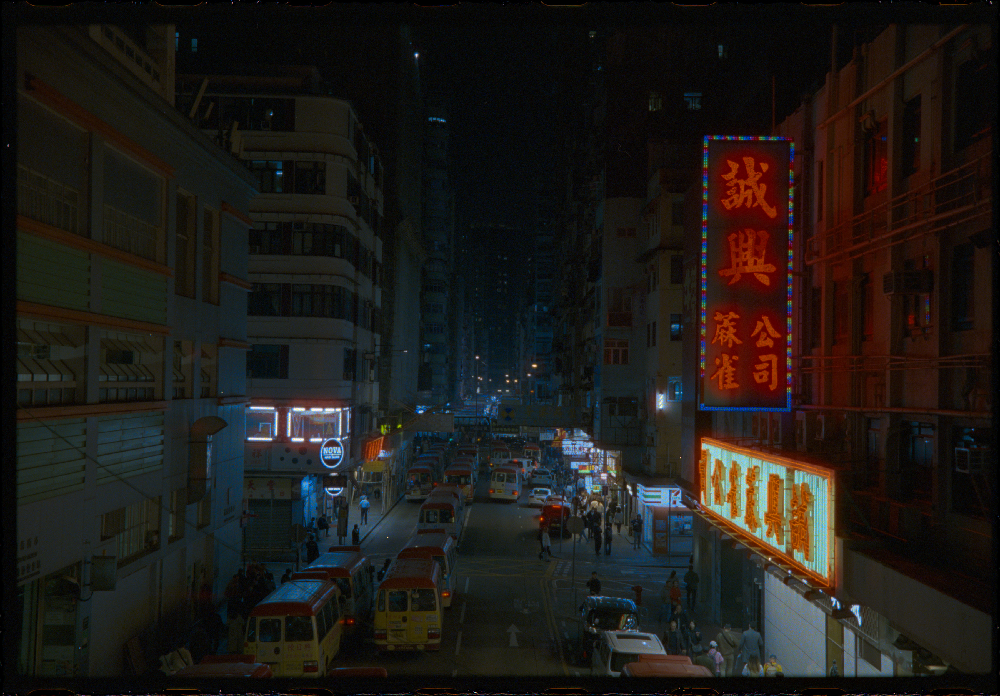

# simple-inversion

## Introduction
This is a python-based command line tool to invert color negatives from camera scan RAW files. It obtains white and black points from a half-exposed leader, performs flat-field correction, applies a gamma correction curve, and batch processes all RAW files within the working directory. The key intent is to automate the inversion process completely, while preserving all information in the negative for downstream work in Lightroom, Darktable, or your photo editor of choice. As such, the tool does not have any interface to correct white balance, adjust saturation, or interactively manipulate the image in any way. All such interactions should be done in a downstream tool you are already famillar with for digital photography.

**WARNING: I'm actively developing this right now. Expect a myriad of bugs and a lack of stability.**

## Setup
Download and install [Python](https://www.python.org/downloads/)

You'll need the following files from this repository in your working folder:

- `invert.py` - Inversion script
- `ProPhotoLinear.icm` - ProPhoto RGB profile with linear gamma
- `GrayLinear.icp` - Grayscale profile with linear gamma
- `requirements.txt` - To resolve dependencies on install

Run this in Command Prompt/Terminal to install dependencies:
```
pip install -r requirements.txt
```
## Camera Scanning
### General settings
Capture all your images with the camera set to "**manual**", at the **lowest native ISO** (typically ISO 100), at the **sharpest aperture** for the lens (typically f/8), and at a **constant shutter speed**.

**It is critical that you do not adjust your camera settings and your light source while scanning the roll. The flat-field corrections and density calculations expects all images to be captured under identical settings and registration.**


### Flat-field correction
Capture an image of the light source with no film in the holder. Adjust your shutter speed to the longest setting without overexposing any part of the image. You can use the highlight warning feature on most cameras to verify this. Use this shutter speed for all images in the batch.


### Half-exposed leader
Capture an image of the half exposed leader, with the exposed section on the left and the unexposed section on the right, and the area separating the two regions in the dead center of the frame. The code will extract the exposed density and base density from this image.


### Negative frame scans
Capture any number of images from same roll.

Put the RAW files in the working folder, ensuring that they are in the following order. If you captured them out of order, you can rename the flat-field and half-exposed leader files to prepend "0" to force the correct order. 

1. Flat-field correction
2. Half-exposed leader
3. Scanned negative frame 1
4. Scanned negative frame 2
5. ... *(Any additional scanned negative frames)*
   


## Inversion
Navigate to the working folder in Command Prompt/Terminal and run
```
python invert.py [--rawext RAWEXT] [--gamma GAMMA] [--halfsize]
                 [--processraw] [--processbw] [--noautocrop] [--mp MP]
```
`rawext`   sets the RAW extension, e.g. `CR3`, `ARW`, or `NEF`, default `CR3`.

`gamma`   sets the gamma factor for the base curve. Use 1 as a default, and decrease it for more shadow detail. Use 0.01 for a log look.

`halfsize` imports the RAW at half-size in both dimensions. Useful for speed.

`processraw` bypasses the color transform and inverts in camera-native RGB space. Use this for narrowband RGB light sources.

`processbw` converts the RAW RGB values to grayscale before inversion.

`noautocrop` disables autocropping based on the flat-field image.

`mp` sets the megapixels the output should be downscaled to. Defaults to no-scaling. Does not upscale.

The code then does the following:
1. Imports flat-field correction file
2. Imports half-exposed leader file
3. Crops images to the bright region in the flat-field image (if enabled)
4. Converts from camera-native RGB to ProPhoto RGB colorspace or monochrome (if enabled)
5. Calculates the exposed density and base density (with flat-field correction)
6. Imports negative frame, converting to the appropriate colorspace
7. Calculates the density of the negative frame (with flat-field correction)
8. Scales the density to [0,1] corresponding to the base and exposed density respectively for each RGB channel 
9. Applies base curve using the user-specified gamma
10. Exports file to a 16-bit linear tiff and attaches a linear profile

## Gamma examples
### Gamma = 0.01 (equivalent to log)


### Gamma = 0.5 (lighter shadows)


### Gamma = 1.0 (normal)


### Gamma = 2.0 (darker shadows)


## FAQ

### Why did you develop this?

I was getting really frustrated with fighting with tone curves that are added on lab scans and on commercial software like Silverfast or Epson Scan. I recently moved to scanning with my mirrorless camera and I wanted a way to get my negative scans quickly into Lightroom while preserving all the underlying information. In addition, I felt that a lot of the commercial tools seemed rather opaque in ther internal processes, and I wanted to use this as an exercise to understand film and digital imaging technology more deeply.

### Why are the output images so dark?

The tool outputs in linear TIFF for both color and monochrome workflows. It embeds a linear profile into the TIFF. If you open it in a tool that doesn't support the embedded color profiles, it will interpret it in the sRGB color space with gamma = 2.2, which ends up being really dark. It should appear normal when imported into a tool with proper color management, like Photoshop or Lightroom.

### Why a command line tool?

I wanted this tool to be optimized for batch processing, with zero user interaction on each individual image at the point of inversion. The intent is for the output images to have maximum flexibility and to have the user only manipulate their images downstream using a Lightroom/Darktable/Photoshop style workflow. 

## To-do

- Multi-roll batch processing (already done, but only tested on mac)
- D-min, D-max estimation from two images (rather than one half-burned image)
- D-max estimation from some high-percentile region across all scans (rather than the leader)
- More principled take on inversion color-space (i.e. reducing cross-talk in dye density estimation)
- More principled take on output color-space (maybe from film spectral sensitivities)
- Alternatively, calibration workflow to profile color checker under flash. 
